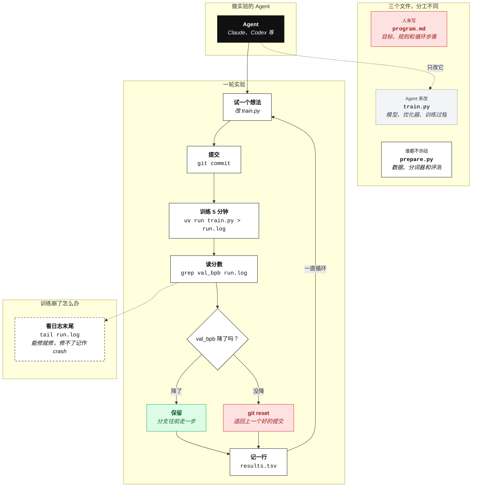

# Karpathy 的 autoresearch 循环

Agent 每一轮只做一件事：改一处训练代码，跑 5 分钟，看 val_bpb 有没有降。val_bpb 是模型在验证集上每个字节平均要用的比特数，越低越好。降了就留下这次改动，没降就退回去，然后接着下一轮。

<!-- section:loop -->

## Agent 要守的规矩

| 规矩 | 具体怎么做 |
| --- | --- |
| 只改一个文件 | 只动 train.py。模型结构、优化器、batch 大小，都在这一个文件里改 |
| 时间固定 | 每次训练跑 5 分钟，一小时大约 12 次；超过 10 分钟的直接杀掉 |
| 裁判不能碰 | prepare.py 里的评测代码不许改，也不许装新的包 |
| 越简单越好 | 分数只好一点点，却多了 20 行别扭的代码，就不要；分数不变、代码变少，就留下 |
| 不停下来问 | 从不问人「要不要继续」，一直跑到有人叫停 |
