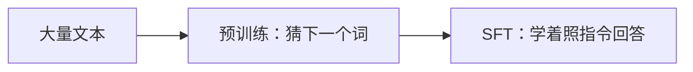

# 先预训练，再做 SFT

模型先读大量文本，一遍遍练习猜下一个词，这一步叫预训练。之后再拿「指令和标准回答」配对的数据接着训练，这一步叫 SFT，也就是监督微调，目的是让它学会照着指令回答。

<!-- section:train -->

```mermaid
flowchart LR
  corpus[大量文本] --> pretrain[预训练：猜下一个词]
  pretrain --> sft[SFT：学着照指令回答]
```
